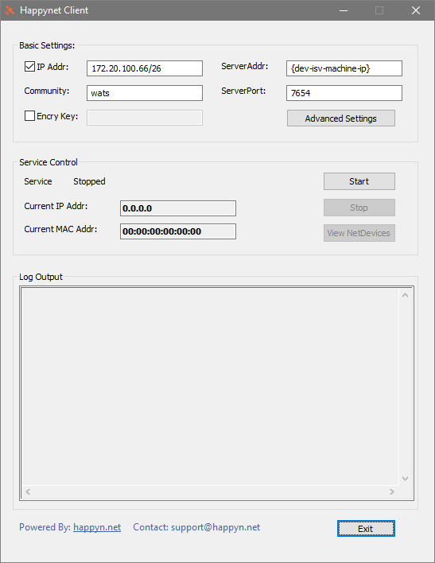
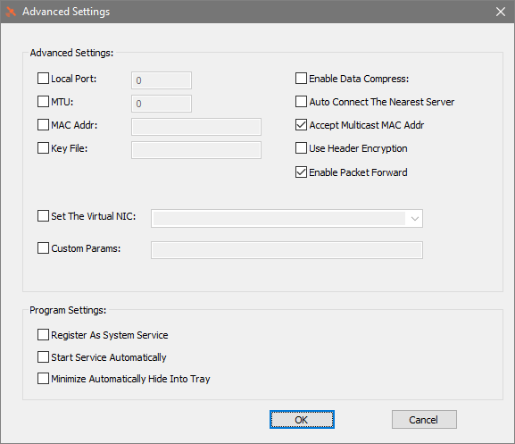
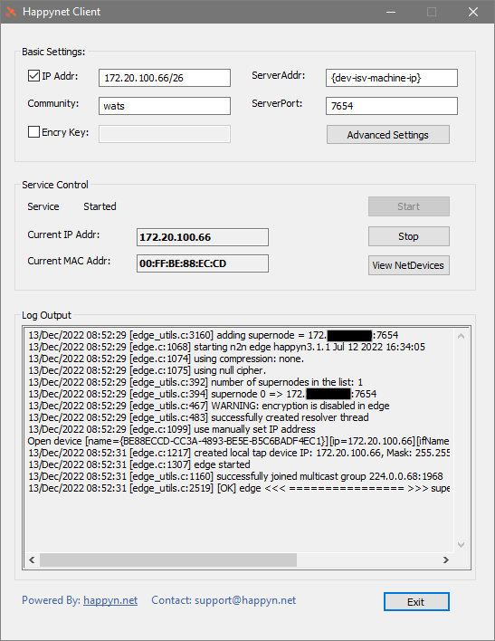
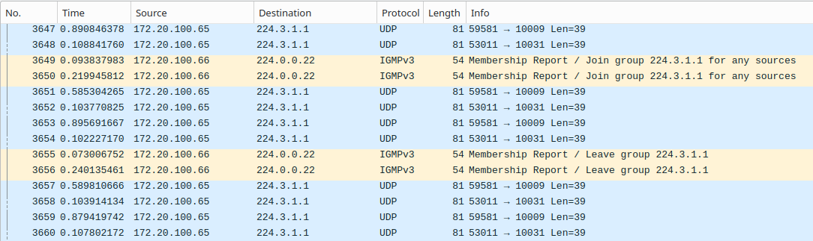

# Multicast transport for WATS DEV-ISV environment
Multicast transport is not supported outside of Virtual Machines run in Azure cloud. Because Market Data and related services (Delayed Market Data, Best Bid Offer etc.) will have to use multicast transport, development of software that will cooperate with Warsaw Stock Exchange/Warsaw Automated Trading System (WSE WATS) will have to implement multicast transport.

There are two ways to perform implementation and testing of services which use multicast transport on the DEV-ISV platform:

1. Remote development
2. Use of [n2n](https://www.ntop.org/products/n2n/) VPN

## Remote development
Development tools of choice can be installed on the machine in coordination with the support team and software can be build and tested on the Virtual Machine using remote development tools.

## Use of n2n network VPN
n2n network allows to transport the multicast stream from the core services installed on the ISV dedicated Virtual Machine to the end node at vendor's premises. n2n network supernode and ingress edge node are already configured on the ISV dedicated Virtual Machine.

Connection using n2n is supplementary to main FortiGate VPN connectivity and can only be successfully started when FortiGate SSL connection is already established.

To use provided n2n connectivity a properly compiled `edge` binary utility compatible with version 3.0 or later of the n2n network tools is required.

### Linux
n2n is available as package for most Linux distributions. Once installed the `edge` command has to be connected to the supernode using following baseline syntax:

```
sudo edge -c wats -a 172.20.100.66/26 -f -l {dev-isv-machine-ip}:7654 -E -r
```

where `{dev-isv-machine-ip}` is the IP address, in a numeric, dot separated form, of the Virtual Machine assigned to particular ISV.

There is a number of additional configuration options (e.g. running the client as daemon etc.) which can be used at someone's convenience as long as they do not interfere with the above functionality.

### Windows
Windows connection to supernode can be performed comfortably with [Happynet Client](https://github.com/happynclient/happynwindows) n2n VPN client. After installation it provides all the binaries required to connect to the provided installation.

Required top level configuration should look like on the screenshot below:



where `{dev-isv-machine-ip}` is the IP address, in a numeric, dot separated form, of the Virtual Machine assigned to particular ISV.

There are some additional settings available after pressing `Advanced Settings` button. It should be set up as shown on the screenshot below:



After the client is configured properly and the FortiGate VPN connection is up the connection can be established with the press of the `Start` button:



Multicast traffic on Microsoft Windows may be limited by a number of factors e.g. VirtualBox virtual interfaces existing on the machine may disable reception of UDP datagrams from multicast groups. It may be required to disable VirtualBox interfaces prior to use of the above resolution.

On Windows multicast traffic may be received only on the designated interface so the proper configuration of the sample Access Clients should look like this (C++ sample client):

```
# Connectivity data
services: &services_default
  market_data: &market_data_default
    snapshot:
      host: {dev-isv-machine-ip}
      port: 10033
    stream:
      host: 224.3.1.1
      port: 10009
      interface: 172.20.100.66
    replay:
      host: {dev-isv-machine-ip}
      port: 10011
  delayed_market_data: &delayed_market_data_default
    stream:
      host: 224.4.1.1
      port: 10031
      interface: 172.20.100.66
(...)
```

### Verification

Once the client is started successfully, UDP traffic of always present Heartbeat messages and IGMP messages announcing joining and leaving of appropriate ulticast groups can be observed on the interface with e.g. Wireshark network monitor:


