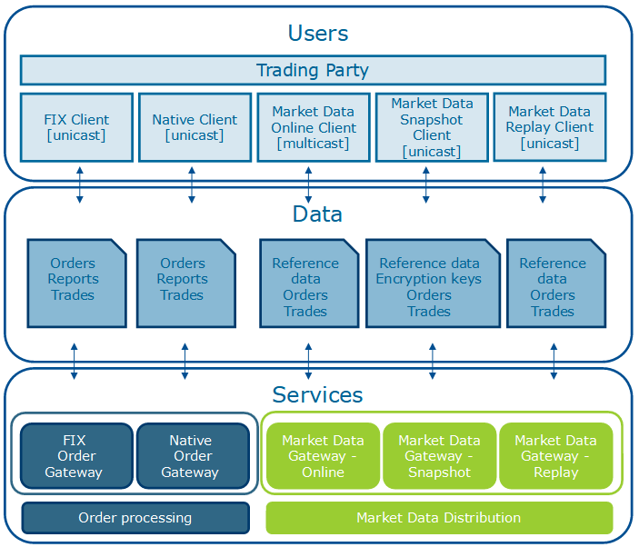
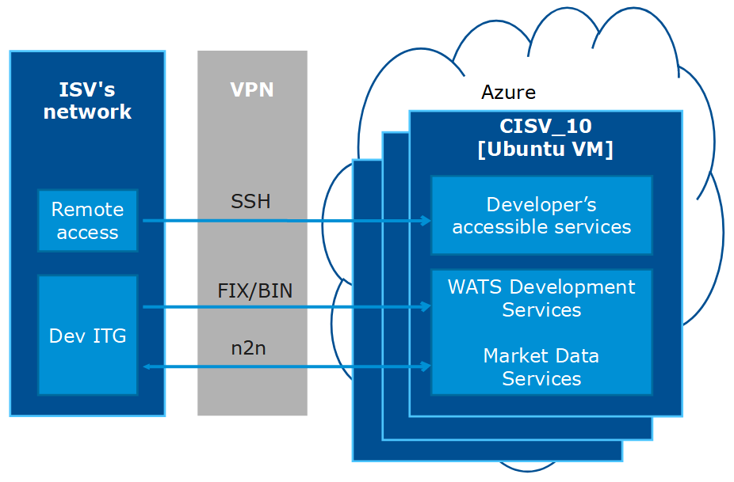
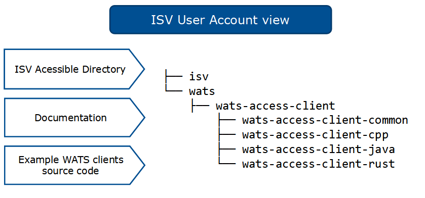

# WATS DEV-ISV environment
This system contains core components of Warsaw Stock Exchange/Warsaw Automated Trading System (WSE/WATS) configured as an introductory development environment for Independent Software Vendors (DEV-ISV).

## Services
Services offered by the WATS system consist of Trading Services (FIX Order Gateway, Native Order Gateway) and Market Data Services (Market Data Stream, Market Data Snapshot and Market Data Replay). Both Trading Services are unicast (TCP) ports which require a client supporting appropriate protocol to submit orders and receive trading information. Market Data services are unicast (Snapshot and Replay) and multicast (UDP) event based data distribution services. In Market Data services distributed data can be partially encrypted.

Detailed description of the services can be found in the documents referenced below.

Outline of the services and they data streams:



## Functionality
System's Trading Services enable following types of order:

* Limit (TIF: DAY, IOC, FOK)
* Market (IOC/FOK)
* Market to limit (IOC/FOK)

Placing, modifying and cancelling of orders through Trading Services:

### FIX Order Gateway

* New Order Single (D)
* Order Cancel Replace (G)
* Order Cancel Request (F)
* Execution Report (8)
* Order Cancel Reject (9)

### Native Order Gateway

* OrderAdd / OrderAddResponse
* OrderModify / OrderModifyResponse
* OrderCancel / OrderCancelResponse
* Trade

### Market Data

* Reference Data
* Market State

## Environment

### Access
Access to the system requires establishing a VPN connection to the network development host, which will, in turn, offer SSH based access to the development host and TCP/IP based access to the services.

Below diagram outlines access methods to cloud hosted DEV-ISV environment:



### User Account
User directory perspective is shown on the below diagram:



Links below lead to source code of sample access clients for native, binary trading protocol, dedicated for the following programming languages:

[WATS Reference Client in Rust](../wats-access-client-rust/README.md)

[WATS Reference Client in C++](../wats-access-client-cpp/README.md)

[WATS Reference Client in Java](../wats-access-client-java/README.md)

### Core Services Maintenance
There is a basic maintenance command set which can be invoked from the command line to Start/Stop/Restart of the core services:

```shell
    sudo systemctl start wats
    sudo systemctl stop wats
    sudo systemctl restart wats
```

To check the status of the services running you can invoke:

```shell
    sudo systemctl status wats
```

Each time the services are restarted the Reference Data database is populated with new data and state files are reset so no trace of previously submitted orders is kept.

## Connectivity Data
There is a live version of core system, limited for development purposes, running on the machine. All of the above shown samples are pre-configured to connect with the services on this machine. Please see respectable configuration files for details.

Below table summarizes the connectivity data for core services on the machine:

| Port                                         | Connectivity data                                                                                                                                                                           |
| -------------------------------------------- | ------------------------------------------------------------------------------------------------------------------------------------------------------------------------------------------- |
| Market Data Snapshot (DDS::OMD::Snapshot)    | ConnectionID = 587<br />Token = ABCDEFGH <br />IP:Port (TCP) = 127.0.0.1:10033                                                                                                              |
| Market Data Stream (DDS::OMD::Stream)        | IP:Port (UDP) = 224.3.1.1:10009                                                                                                                                                             |
| Market Data Replay (DDS::OMD::Replay)        | IP:Port (TCP) = 127.0.0.1:10011                                                                                                                                                             |
| Best Bid Offer Snapshot (DDS::BBO::Snapshot) | ConnectionID = 587<br />Token = ABCDEFGH <br />IP:Port (TCP) = 127.0.0.1:10035                                                                                                              |
| Best Bid Offer Stream (DDS::BBO::Stream)     | IP:Port (UDP) = 224.3.1.1:10031                                                                                                                                                             |
| Best Bid Offer Replay (DDS::BBO::Replay)     | IP:Port (TCP) = 127.0.0.1:10032                                                                                                                                                             |
| FIX Order Gateway (OEG::FIX)                 | Connection #1<br /><br />TargetCompId = WATS_FIX_TP<br />SenderCompId = WATSAC01_FIX01<br />Token = ABCDEFGH<br />IP:Port (TCP) = 127.0.0.1:10050                                           |
|                                              | Connection #2<br /><br />TargetCompId = WATS_FIX_TP<br />SenderCompId = WATSAC02_FIX01<br />Token = ABCDEFGH<br />IP:Port (TCP) = 127.0.0.1:10050                                           |
| Native Order Gateway (OEG::BIN)              | Connection #1<br /><br />ConnectionID = 581<br />Token = ABCDEFGH<br />IP:Port (TCP) = 127.0.0.1:10010                                                                                      |
|                                              | Connection #2<br /><br />ConnectionID = 589<br />Token = ABCDEFGH<br />IP:Port (TCP) = 127.0.0.1:10010                                                                                      |
| Drop Copy Service (OEG::DCP)                 | TargetCompId = WATS_FIX_DC<br />SenderCompId = WATSAC01_FIXDC<br />Token = ABCDEFGH<br />IP:Port (TCP) = 127.0.0.1:10052<br /><br />Works with OEG::FIX and OEG::BIN connection #1 |
|                                              | TargetCompId = WATS_FIX_DC<br />SenderCompId = WATSAC02_FIXDC<br />Token = ABCDEFGH<br />IP:Port (TCP) = 127.0.0.1:10052<br /><br />Works with OEG::FIX and OEG::BIN connection #2 |

Initially encryption of Market Data streams will not be enabled. After enabling, encryption keys will be distributed through `EncryptionKey` messages of Market Data Snapshot (DDS::OMD::Snapshot) service which should be read as first of all Market Data streams.

## FIX protocol helpers

Repository contains messages definitions for FIX protocol in XML format, complaint with QuickFIX library:

* [FIX50SP2.xml](quickfix/FIX50SP2.xml)
* [FIXT11.xml](quickfix/FIXT11.xml)

## Reference Documents
Documentation of the trading protocols supported by the EUAT WATS:

### Introduction

* [GPW WATS 1.01 Trading System](docs/GPW%20WATS%201.01%20Trading%20System%20v0.59.pdf)
* [GPW WATS 1.02 Glossary](docs/GPW%20WATS%201.02%20Glossary%20v0.59.pdf)

### Trading Protocols

* [GPW WATS 2.01 Native Order Gateway Specification](docs/GPW%20WATS%202.01%20Native%20Order%20Gateway%20Specification%20v0.59.pdf)
* [GPW WATS 2.02 FIX Order Gateway Specification (FIX 5.0)](docs/GPW%20WATS%202.02%20FIX%20Order%20Gateway%20Specification%20v0.59.pdf)

### Data Distribution Service

* [GPW WATS 3.01 Market Data Protocol](docs/GPW%20WATS%203.01%20Market%20Data%20Protocol%20v0.59.pdf)

### Other Services

* [GPW WATS 4.01 Drop Copy Gateway](docs/GPW%20WATS%204.01%20Drop%20Copy%20Gateway%20v0.59.pdf)
* [GPW WATS 4.02 Post Trade Gateway](docs/GPW%20WATS%204.02%20Post%20Trade%20Gateway%20v0.59.pdf)
* [GPW WATS 5.01 Risk Management Gateway](docs/GPW%20WATS%205.01%20Risk%20Management%20Gateway%20v0.59.pdf)

### Additional Documentation

* [GPW WATS 2.03 Rejection Codes](docs/GPW%20WATS%202.03%20Rejection%20Codes%20v0.59.pdf)
* [GPW WATS 2.04 BenDec Message Definition Format](docs/GPW%20WATS%202.04%20BenDec%20Mesage%20Definition%20Format%20v0.59.pdf)
* [GPW WATS 6.01 Connectivity](docs/GPW%20WATS%206.01%20Connectivity%20v0.59.1.pdf)
* [GPW WATS Advancement](docs/GPW%20WATS%20Advancement.pdf)

## Support
If you have any doubts please feel free to contact support for WATS Access Client development environment for ISVs:

| Channel | Contact         |
| ------- | --------------- |
| Name:   | Piotr Demczuk   |
| E-mail: | ts@gpw.pl       |
| Phone:  | +48 603 855 040 |
